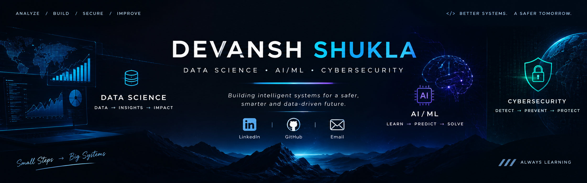

  

&nbsp;

&nbsp;

 

---

## ⚡ ABOUT ME

I'm a **BTech CSE student** focused on building practical, data-driven and security-oriented technology projects.

I like turning ideas into working systems:

**PROBLEM → DATA → CODE → MODEL → APPLICATION → DEPLOYMENT**

My current areas of interest:

- 📊 **Data Science & Analytics**
- 🤖 **Artificial Intelligence & Machine Learning**
- 🔐 **Cybersecurity**
- 💻 **Python-based software development**
- 🚀 **Real-world projects and deployment**

---

## 🧠 WHAT I BUILD

<table>
<tr>
<td width="50%">

### 📊 DATA SCIENCE

Data analysis, visualization, predictive analytics and interactive dashboards.

</td>
<td width="50%">

### 🤖 AI / ML

Machine learning models and intelligent applications built around practical problems.

</td>
</tr>
<tr>
<td width="50%">

### 🔐 CYBERSECURITY

Security-focused tools, detection systems and defensive technology.

</td>
<td width="50%">

### 💻 SOFTWARE

Python applications, APIs, automation and data-driven web applications.

</td>
</tr>
</table>

---

## 🛠️ TECH STACK

### Languages

### Data Science & AI

**Pandas** • **NumPy** • **Scikit-learn** • **Plotly** • **Streamlit** • **Jupyter**

### Development Tools

---

## 🚀 FEATURED PROJECTS

  <em>A selection of projects across AI, Data Science, and Cybersecurity — from deployed dashboards to intelligent system prototypes.</em>

<table>
<tr>
<td width="50%" valign="top">

<h3>🚦 AI Urban Traffic Command Center</h3>

An ML-assisted decision-support prototype combining congestion classification, signal-planning logic, simulation, demand forecasting, and model-based environmental analysis. **Uses simulated traffic data, not live infrastructure.**

**Stack:** Python · Machine Learning · FastAPI · Streamlit

<a href="https://github.com/devanshshukla-3004/AI-Urban-Traffic-Command-Center">Source Code</a> · <a href="https://ai-urban-traffic-command-center.onrender.com/">Live Dashboard</a> · <a href="https://youtu.be/LpmQ1EvWxpo">Video Demo</a>

</td>
<td width="50%" valign="top">

<h3>🛡️ SentinelIQ — SOC Decision Intelligence</h3>

A foundation for helping Security Operations Center managers understand operational workload and plan analyst capacity using traceable evidence. The current stage provides the app/API/data foundation with clearly labeled demonstration values.

**Stack:** Next.js · TypeScript · FastAPI · PostgreSQL · Docker

<a href="https://github.com/devanshshukla-3004/SentinelIQ">Explore Repository</a>

 

Forecasting and recommendation capabilities are planned, not yet implemented.

</td>
</tr>
<tr>
<td width="50%" valign="top">

<h3>📊 HR Employee Attrition Dashboard</h3>

An interactive workforce analytics dashboard exploring attrition patterns, employee segments, and risk-related insights using the IBM HR Analytics dataset.

**Stack:** Python · Pandas · Plotly · Streamlit · Scikit-learn

<a href="https://github.com/devanshshukla-3004/HR-Employee-Attrition-and-Workforce-Analytics-Dashboard">Source Code</a> · <a href="https://hr-employee-attrition-and-workforce-analytics-dashboard-dirquy.streamlit.app/">Live Demo</a>

</td>
<td width="50%" valign="top">

<h3>🍳 Kitchen Copilot</h3>

A hands-free voice cooking assistant designed around reliable interruption and recovery: interrupted speech or stale tool results must not advance the recipe state incorrectly.

**Stack:** Python · Voice AI · LiveKit Agents · Groq · Rime

<a href="https://github.com/devanshshukla-3004/Kitchen-copilot">Explore Repository</a>

</td>
</tr>
<tr>
<td width="50%" valign="top">

<h3>🤖 HireFlow</h3>

An AI-assisted candidate-screening and interview-intelligence prototype that organizes evidence for review while keeping hiring decisions with people.

**Stack:** HTML · CSS · JavaScript · Gemini API

<a href="https://github.com/devanshshukla-3004/HireFlow">Explore Repository</a>

</td>
<td width="50%" valign="top">

<h3>📬 Inbox-Copilot</h3>

An email-triage automation project designed to support email organization and recurring workflow processing.

**Stack:** Python · Gemini API · Firestore · GitHub Actions

<a href="https://github.com/devanshshukla-3004/Inbox-Copilot">Explore Repository</a>

</td>
</tr>
</table>

<strong>🔐 More cybersecurity projects</strong>

 
<a href="https://github.com/devanshshukla-3004/CodeOrbit_PhishingEmailIdentifier">Phishing Email Identifier</a> ·
<a href="https://github.com/devanshshukla-3004/CodeOrbit_NetworkScanningExercise">Network Scanning Exercise</a> ·
<a href="https://github.com/devanshshukla-3004/CodeOrbit_VulnerabilityAssessment">Vulnerability Assessment</a> ·
<a href="https://github.com/devanshshukla-3004/CS_2_PasswordStrengthChecker_BYTE">Password Strength Checker</a> ·
<a href="https://github.com/devanshshukla-3004/CS_5_OTPGeneratorVerifier_BYTE">OTP Generator &amp; Verifier</a>

  <a href="https://github.com/devanshshukla-3004?tab=repositories"><strong>Browse all repositories →</strong></a>

---

## 🎯 CURRENT FOCUS

<table>
<tr>
<td>🐍 Advanced Python</td>
<td>📊 Data Science & ML</td>
<td>🤖 AI Applications</td>
</tr>
<tr>
<td>🔐 Cybersecurity</td>
<td>🌐 APIs & Deployment</td>
<td>🧩 Real-world Systems</td>
</tr>
</table>

I'm working toward a portfolio of **advanced, practical systems** across Data Science, AI/ML and Cybersecurity.

---

## 📈 GITHUB ACTIVITY

&nbsp;

  

**Explore my contributions, repositories and ongoing projects on GitHub.**

---

## 🧭 BUILD PHILOSOPHY

### **LEARN → BUILD → DEPLOY → IMPROVE**

*Understand the problem. Build the system. Test it. Deploy it. Keep improving it.*

---

## 🤝 LET'S CONNECT

&nbsp;

&nbsp;

  

<b>Building intelligent systems for a safer, smarter and data-driven future.</b>

